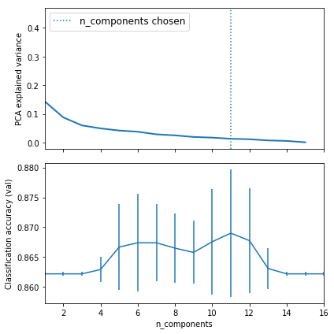
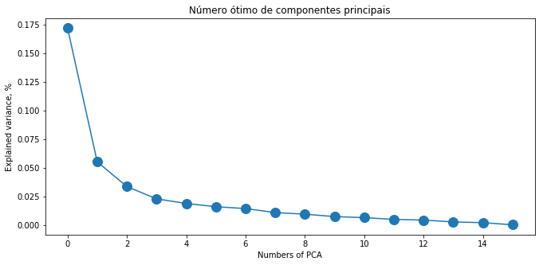
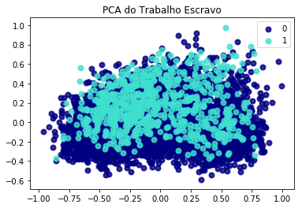
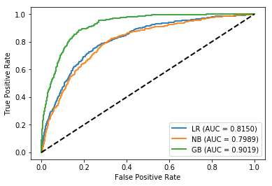
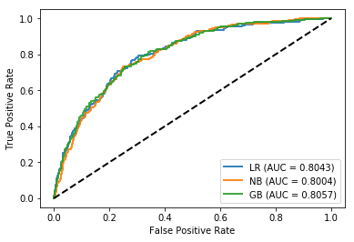
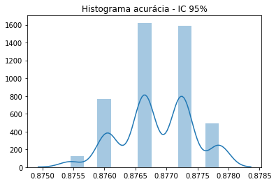

#### Objetivos: Implementar modelagem em base de dados real, aplicando os conceitos de:
* Seleção de variáveis
* PCA (redução de dimensionalidade)
* Classificação com os modelos: Regressão Logistica, NB e GBM
* Realizar teste estatístico (Bootstrap)

#### Conjunto de dados: 
* operações de resgate do trabalho escravo no Brasil de 2003 a 2018

##### Obs. O entendimento e o pré-processamento dos dados foram realizados previamente


#### Estrutura
1. Inicializa pacotes e bibliotecas
2. Carrega dados
3. Padroniza variáveis independentes
4. Seleção de variáveis por regularização - LASSO (L1)
5. Principal Component Analysis PCA 
6. Modelagem com classificadores: Regressão Logística, Gaussian Naive Bayes (NB) e Gradient Boosting Machine (GBM)
7. Teste estatístico com Bootstrapping 
8. Considerações finais
9. Funções utilizadas


#### 1. Inicializa pacotes e bibliotecas utilizadas


```python
import numpy as np
import matplotlib.pyplot as plt
import pandas as pd
from sklearn import datasets
from sklearn.decomposition import PCA
from sklearn.linear_model import SGDClassifier
from sklearn.pipeline import Pipeline
from sklearn.model_selection import GridSearchCV
from multiprocessing import Pool, Process, Queue, Pipe, Lock, Value, Array, Manager, TimeoutError
import os
import pandas as pd
import numpy as np
import time
import seaborn as sns
from matplotlib import pyplot
from sklearn.preprocessing import MinMaxScaler
from sklearn.linear_model import LassoCV
from sklearn.naive_bayes import GaussianNB
from sklearn.svm import SVR
from sklearn.ensemble import GradientBoostingClassifier
from sklearn.neural_network import MLPClassifier
from sklearn.linear_model import LogisticRegression
from sklearn.svm import SVC
from imblearn.metrics import geometric_mean_score
from sklearn.model_selection import train_test_split
from sklearn import model_selection
from sklearn import metrics
from sklearn.metrics import confusion_matrix,f1_score, precision_score, auc,roc_auc_score,roc_curve, precision_recall_curve, recall_score,accuracy_score
import matplotlib.pyplot as plt
from sklearn.feature_selection import SelectFromModel
from sklearn.model_selection import train_test_split
from sklearn.model_selection import GridSearchCV
from imblearn.over_sampling import RandomOverSampler
import matplotlib.pyplot as plt

import warnings
warnings.simplefilter(action='ignore')
from sklearn.exceptions import DataConversionWarning
warnings.filterwarnings(action='ignore', category=DataConversionWarning)


```

#### 2. Carrega dados


```python
df = pd.read_csv('../data/merge.csv',low_memory=False)

# Retira variáveis não necessárias
df=df.drop(['trabalhadores_resgatados','municipio_key','nm_uf','id'], axis=1)


```

#### 3. Padroniza variáveis independentes
#### X entrada, y saída


```python
X = df.iloc[:,5:237]
y = df.escravo
XY = df.iloc[:,5:238]

scaler = MinMaxScaler()
X[X.columns] = scaler.fit_transform(X[X.columns])
#XY[X.columns] = scaler.fit_transform(XY[X.columns])

```


```python
XY.head(2)
```


<div>
<style scoped>
    .dataframe tbody tr th:only-of-type {
        vertical-align: middle;
    }

    .dataframe tbody tr th {
        vertical-align: top;
    }

    .dataframe thead th {
        text-align: right;
    }
</style>
<table border="1" class="dataframe">
  <thead>
    <tr style="text-align: right;">
      <th></th>
      <th>espvida</th>
      <th>fectot</th>
      <th>mort1</th>
      <th>mort5</th>
      <th>razdep</th>
      <th>sobre40</th>
      <th>sobre60</th>
      <th>t_env</th>
      <th>e_anosestudo</th>
      <th>t_analf11a14</th>
      <th>...</th>
      <th>pia18m</th>
      <th>pop</th>
      <th>popt</th>
      <th>i_escolaridade</th>
      <th>i_freq_prop</th>
      <th>idhm</th>
      <th>idhm_e</th>
      <th>idhm_l</th>
      <th>idhm_r</th>
      <th>escravo</th>
    </tr>
  </thead>
  <tbody>
    <tr>
      <th>0</th>
      <td>70.75</td>
      <td>2.24</td>
      <td>23.8</td>
      <td>25.49</td>
      <td>47.37</td>
      <td>94.50</td>
      <td>83.18</td>
      <td>5.84</td>
      <td>8.67</td>
      <td>1.22</td>
      <td>...</td>
      <td>16431.0</td>
      <td>24097</td>
      <td>22429</td>
      <td>0.368</td>
      <td>0.629</td>
      <td>0.641</td>
      <td>0.526</td>
      <td>0.763</td>
      <td>0.657</td>
      <td>0</td>
    </tr>
    <tr>
      <th>1</th>
      <td>73.36</td>
      <td>1.91</td>
      <td>19.2</td>
      <td>20.53</td>
      <td>46.68</td>
      <td>96.12</td>
      <td>87.69</td>
      <td>4.36</td>
      <td>9.18</td>
      <td>1.55</td>
      <td>...</td>
      <td>60213.0</td>
      <td>89766</td>
      <td>88730</td>
      <td>0.514</td>
      <td>0.648</td>
      <td>0.702</td>
      <td>0.600</td>
      <td>0.806</td>
      <td>0.716</td>
      <td>1</td>
    </tr>
  </tbody>
</table>
<p>2 rows × 233 columns</p>
</div>


#### 4. Seleção de variáveis por regularização - LASSO (L1)
##### A ideia foi utilizar uma técnica para seleção de variáveis, resultando em um subconjunto de variáveis com maior grau de importância para o modelo. 
##### Devido ao alto grau de dimensionalidade, com 232 variáveis + 1 alvo (escravo), esta etapa é primordial.


```python
def lasso_(X,y):
    num_features = len(X.columns)
    clf = LogisticRegression(C=0.1,penalty = 'l1')
    clf.fit(X,y)
    zero_feat = []
    nonzero_feat = []
    abs_feat = []
    for i in range(num_features):
        coef = clf.coef_[0,i]
        if coef == 0:
            zero_feat.append(X.columns[i])
        else:
            nonzero_feat.append((coef, X.columns[i]))

    print ('Variaveis com coeficiente zero: ', len(zero_feat))
    print ('Variaveis selecionadas:')
    print (sorted(nonzero_feat, reverse = True))
    
    

```

##### 216 variáveis fora eliminadas com a técnica de penalização e 16 variáveis foram selecionadas.


```python
# Chamada na função lasso_() para realizar a Seleção de variáveis.
lasso_(X,y)
```

    Variaveis com coeficiente zero:  216
    Variaveis selecionadas:
    [(1.530182571058944, 'prentrab'), (0.6342283001411675, 'parede'), (0.5877743502165127, 't_atraso_1_basico'), (0.40413755821255565, 't_agua'), (0.3876778951603006, 'pren10ricos'), (0.3572131187201117, 't_super25m'), (0.27981627466657805, 'trabsc'), (-0.14766392349401283, 't_freq4a5'), (-0.367663908053415, 'pren40'), (-0.4712133234766228, 'ren2'), (-0.5661567245409527, 'rind'), (-0.9408619886536362, 't_flpre'), (-1.0173559356708657, 'pren20'), (-1.1936811143772472, 'p_transf'), (-1.4450673364882742, 'ren1'), (-3.8072514873057925, 't_env')]


##### Variáveis selecioandas:


```python
selecionados =['prentrab', 'parede', 't_atraso_1_basico', 't_agua', 'pren10ricos', 't_super25m',
               'trabsc', 't_freq4a5', 'ren2', 'pren40','rind', 'pren20','t_flpre','p_transf', 'ren1','t_env']

```


```python
# Variável a ser prevista
atrib_prev = ['escravo']
X_s=X[selecionados]
```

#### 5. Principal Component Analysis PCA 

Com o subgrupo de variáveis, a ideia foi explorar a linearidade entre variáveis, bem como verificar a melhor quantidade de componente principais para o subgrupo selecionado. Para isso foi utilizado uma pipeline de busca por melhores parametros, onde então é realizado combinações.

Os resultados indicam que o melhor número de componentes são: 11 (para o sub grupo de dados utilizados)


```python
# Pipeline para busca de parâmetros no PCA
logistic = SGDClassifier(loss='log', penalty='l2', early_stopping=True,
                         max_iter=10000, tol=1e-5, random_state=0)
pca = PCA()
pipe = Pipeline(steps=[('pca', pca), ('logistic', logistic)])

# Configuracao do grid
param_grid = {
    'pca__n_components': [1,2,3,4,5,6,7,8,9,10,11,12,13,14,15,16],
    'logistic__alpha': np.logspace(-4, 4, 5),
}
search = GridSearchCV(pipe, param_grid, iid=False, cv=5)
search.fit(X_s, y)
print("Best parameter (CV score=%0.3f):" % search.best_score_)
print(search.best_params_)

# Plot the PCA spectrum
pca.fit(X_s)

fig, (ax0, ax1) = plt.subplots(nrows=2, sharex=True, figsize=(6, 6))
ax0.plot(pca.explained_variance_ratio_, linewidth=2)
ax0.set_ylabel('PCA explained variance')

ax0.axvline(search.best_estimator_.named_steps['pca'].n_components,
            linestyle=':', label='n_components chosen')
ax0.legend(prop=dict(size=12))

# For each number of components, find the best classifier results
results = pd.DataFrame(search.cv_results_)
components_col = 'param_pca__n_components'
best_clfs = results.groupby(components_col).apply(
    lambda g: g.nlargest(1, 'mean_test_score'))

best_clfs.plot(x=components_col, y='mean_test_score', yerr='std_test_score',
               legend=False, ax=ax1)
ax1.set_ylabel('Classification accuracy (val)')
ax1.set_xlabel('n_components')

plt.tight_layout()
plt.show()
```

    Best parameter (CV score=0.869):
    {'logistic__alpha': 0.0001, 'pca__n_components': 11}





```python
plt.figure(figsize=(11, 5))
plt.plot(pca.explained_variance_, 'o-', markersize=12)
plt.xlabel('Numbers of PCA')
plt.ylabel('Explained variance, %')
plt.title("Número ótimo de componentes principais")
plt.show() 
```





```python
pca = PCA(n_components=11)
principalComponents = pca.fit_transform(X_digits)
principalDf = pd.DataFrame(data = principalComponents
             , columns = ['pc1', 'pc2','pc3', 'pc4','pc5', 'pc6','pc7','pc8', 'pc9','pc10', 'pc11',])
```

É possível pegar uma amostra dos valores dos componentes:


```python
finalDf = pd.concat([principalDf, XY[['escravo']]], axis = 1)
finalDf.head()
```


<div>
<style scoped>
    .dataframe tbody tr th:only-of-type {
        vertical-align: middle;
    }

    .dataframe tbody tr th {
        vertical-align: top;
    }

    .dataframe thead th {
        text-align: right;
    }
</style>
<table border="1" class="dataframe">
  <thead>
    <tr style="text-align: right;">
      <th></th>
      <th>pc1</th>
      <th>pc2</th>
      <th>pc3</th>
      <th>pc4</th>
      <th>pc5</th>
      <th>pc6</th>
      <th>pc7</th>
      <th>pc8</th>
      <th>pc9</th>
      <th>pc10</th>
      <th>pc11</th>
      <th>escravo</th>
    </tr>
  </thead>
  <tbody>
    <tr>
      <th>0</th>
      <td>0.108799</td>
      <td>0.632460</td>
      <td>-0.100407</td>
      <td>-0.059520</td>
      <td>-0.061458</td>
      <td>-0.158455</td>
      <td>0.069243</td>
      <td>-0.048837</td>
      <td>-0.079518</td>
      <td>-0.110502</td>
      <td>-0.006094</td>
      <td>0</td>
    </tr>
    <tr>
      <th>1</th>
      <td>-0.283818</td>
      <td>0.497275</td>
      <td>-0.166798</td>
      <td>0.115194</td>
      <td>-0.019565</td>
      <td>0.069817</td>
      <td>0.078578</td>
      <td>-0.040387</td>
      <td>-0.072134</td>
      <td>-0.021477</td>
      <td>-0.006238</td>
      <td>1</td>
    </tr>
    <tr>
      <th>2</th>
      <td>-0.062615</td>
      <td>0.149691</td>
      <td>-0.042640</td>
      <td>0.011175</td>
      <td>0.005149</td>
      <td>-0.033607</td>
      <td>0.000416</td>
      <td>-0.053863</td>
      <td>-0.162688</td>
      <td>-0.082522</td>
      <td>-0.058702</td>
      <td>0</td>
    </tr>
    <tr>
      <th>3</th>
      <td>-0.245588</td>
      <td>0.370297</td>
      <td>-0.244629</td>
      <td>-0.042920</td>
      <td>0.021341</td>
      <td>-0.058265</td>
      <td>0.019964</td>
      <td>-0.001229</td>
      <td>-0.038496</td>
      <td>-0.091237</td>
      <td>-0.018047</td>
      <td>0</td>
    </tr>
    <tr>
      <th>4</th>
      <td>-0.146514</td>
      <td>0.240342</td>
      <td>-0.008499</td>
      <td>0.020280</td>
      <td>0.081181</td>
      <td>-0.051858</td>
      <td>-0.100560</td>
      <td>-0.009490</td>
      <td>-0.080348</td>
      <td>-0.060474</td>
      <td>-0.035422</td>
      <td>1</td>
    </tr>
  </tbody>
</table>
</div>


Para melhor visualização:
* 0 - indica ausência do trabalho escravo
* 1 - indica presença do trablaho escravo


```python

target_names = [0,1]

pca = PCA(n_components=11)
X_r = pca.fit(X_s).transform(X_s)

#  Porcentagem de variância explicada para cada componente
print('Razão de variância explicada: %s'
      % str(pca.explained_variance_ratio_))

plt.figure()
colors = ['navy', 'turquoise']
lw = 2

for color, i, target_name in zip(colors, [0,1], target_names):
    plt.scatter(X_r[y == i, 0], X_r[y == i, 1], color=color, alpha=.8, lw=lw,
                label=target_name)
plt.legend(loc='best', shadow=False, scatterpoints=1)
plt.title('PCA do Trabalho Escravo')


plt.show()
```

    Razão de variância explicada: [0.44789656 0.14410424 0.08790111 0.05999895 0.04951029 0.04214407
     0.03791371 0.02882399 0.02516627 0.01965494 0.01733414]





#### 6. Modelagem com classificadores: Regressão Logística, Gaussian Naive Bayes (NB) e Gradient Boosting Machine (GBM)
#### 6.1 Divisão dos Dados
* 70% treinamento
* 30% treinamento


```python
# Separa os dados 
split_test_size =0.3

datasets3 = []
X_imb3, Y_imb3 = split_s_colunas(df,selecionados,atrib_prev) #usado para gerar testes com base original
X_treino_imb3, X_teste_imb3, Y_treino_imb3, Y_teste_imb3 = split_data(X_imb3, Y_imb3,split_test_size)

```

#### 6.2 Balanceamento de dados (usado para treinar os modelos)
* A técnica utilizada para balancemento de dados foi RandomOverSampling (ROS)
Foi feito um benchmarking comparando com outras técnicas, ROS obteve melhor desempenho nos testes.


```python
# chama função balance_datasets (disponível ao final do documento)
datasets3 = balance_datasets(X_treino_imb3,Y_treino_imb3)
```

    Transforming RandomOverSampler


#### 6.3 Modelagem com dados de Treinamento

O algoritmo Gradient Boosting Machine, destacou-se com melhor desempenho nos treinamentos. Se comparado com Gaussian Naive Bayes e Regressão Logística.


```python
# chama função analisa_modelo_train (disponível ao final do documento)
# a função passa um array de dados, e também os conjuntos de dados separados de variáveis independentes e variável dependente.
# Retorna: a avaliação para os modelos e respectiva curva roc, provida pelos valores de AUC.
analisa_modelo_train(datasets3, X_treino_imb3, Y_treino_imb3)
```

    Avaliação de treino
         nome      Sampling Type  accuracy       auc  precision    recall  \
    0      LR  RandomOverSampler  0.748940  0.814979   0.747897  0.750880   
    1      NB  RandomOverSampler  0.740402  0.798943   0.731932  0.758679   
    2      GB  RandomOverSampler  0.832280  0.901938   0.809240  0.870795   
    mean  NaN                NaN  0.773874  0.838620   0.763023  0.793452   
    
                f1    g_mean  
    0     0.749267  0.748948  
    1     0.744972  0.740182  
    2     0.838894  0.831706  
    mean  0.777711  0.773612  





#### 6.4 Modelagem com dados de Teste
Os resultados indicam aproximidade entre os modelos, com uma pequena diferença para o modelo com uso de Gradient Boost.
Também é possível observar que a curva ROC apresenta um pouco mais de Falsos positivos se comparado ao treinamento.


```python
# Chamada da função que faz a modelagem em dados de teste
analisa_modelo_test(datasets3,X_teste_imb3,Y_teste_imb3)
```

    Avaliação de teste
         nome      Sampling Type  accuracy       auc  precision    recall  \
    0      LR  RandomOverSampler  0.737126  0.804341   0.282486  0.721154   
    1      NB  RandomOverSampler  0.732335  0.800359   0.281536  0.740385   
    2      GB  RandomOverSampler  0.774251  0.805706   0.306636  0.644231   
    mean  NaN                NaN  0.747904  0.803469   0.290219  0.701923   
    
                f1    g_mean  
    0     0.405954  0.730219  
    1     0.407947  0.735773  
    2     0.415504  0.714642  
    mean  0.409802  0.726878  
    





#### 7. Teste estatístico com Bootstrapping 
Com aplicação do teste estatístico com 150 interações é possível identificar que o modelo apresenta Robustez. Com bons resultados, o teste demonstra ótimo desempenho e dentro do intervalo de confiança de 95%.


```python
# Bootstrapping

values = df.values
n_iter = 150

resultados = list()
start_time = time.time()
#tamanho a ser usado no treinamento

for i in range(n_iter):
    # divisao de dados em treino e teste
    X_treino_imb3, X_teste_imb3, Y_treino_imb3, Y_teste_imb3 = split_data(X_imb3, Y_imb3,split_test_size)

    
    # fit model (o melhor modelo apresentado nos testes foi GB. Deste modo escolhido para fazer o teste de Robustez)
    mod = GradientBoostingClassifier()

    ml =  mod.fit(X_treino_imb3, Y_treino_imb3)
    model_pd = ml.predict(X_teste_imb3)
    
    acc_=metrics.accuracy_score(Y_teste_imb3, model_pd)
    resultados.append(acc_)


# Chama funcao com o Intervalo de confianca (IC)
intervalo(resultados)

print("\nO tempo de execução foi de %.2f minutos." % ((time.time() - start_time) / 60))
```

    Para o intervalo de confiança de 95.0%, os resultados estão entre 87.6% e 87.8%
    
    O tempo de execução foi de 1.37 minutos.


```python
# Imprimi histograma
fig=sns.distplot(resultados)
pyplot.title("Histograma acurácia - IC 95%")
pyplot.show(fig)
```





#### 8. Considerações finais

##### Foi possível aplicar os conceitos aprendidos em sala de aula, principalmente referente a seleção de variáveis e testes com técnicas de robustez, as técnicas demonstram ser eficazes e de importante valor.

##### Para trabalhos futuros, pretendo utilizar um modelo multiclasse, logo implementarei uma abordagem com Naive Bayes para três categorias de classes. 

#### FUNÇÕES UTILIZADAS


```python
# Função para o calculo do IC, usada no conjunto de treinamento
def intervalo(resultado):
    alpha = 0.95
    p = ((1.0-alpha)/2.0) * 100
    lower = max(0.0, np.percentile(resultado, p))
    p = (alpha+((1.0-alpha)/2.0)) * 100
    upper = min(1.0, np.percentile(resultado, p))
    print('Para o intervalo de confiança de %.1f%%, os resultados estão entre %.1f%% e %.1f%%' % (alpha*100, lower*100, upper*100))


# Pega o nome das colunas, para as variáveis selecionadas
def check_features(estimator,cols):  

    temp = pd.Series(estimator.support_,index = cols)
    selected_features_rfe = temp[temp==True].index
    print(selected_features_rfe)

# Ranking das n melhores variáveis 
def best_worst (scores,x):
    scores = sorted(scores, reverse = True)

    print("As "+ str(x) +" melhores variaveis selecionadas :")
    var=[]
    for i in range(x):
        print("%d° - " % i+1, scores[i][1])
        var.append(scores[i][1])

    print(var) 


#numero de features
def n_features_score(X,y):
    nof_list=np.arange(1,237)            
    high_score=0
    #Variable to store the optimum features
    nof=0           
    score_list =[]
    for n in range(len(nof_list)):
        X_train, X_test, y_train, y_test = train_test_split(X,y, test_size = 0.3, random_state = 0)
        model = LogisticRegression()
        rfe = RFE(model,nof_list[n])
        X_train_rfe = rfe.fit_transform(X_train,y_train)
        X_test_rfe = rfe.transform(X_test)
        model.fit(X_train_rfe,y_train)
        score = model.score(X_test_rfe,y_test)
        score_list.append(score)
        if(score>high_score):
            high_score = score
            nof = nof_list[n]
    print("Optimum number of features: %d" %nof)
    print("Score with %d features: %f" % (nof, high_score))

def l2_regularization(X,y):
    num_features = len(X.columns)
    param_grid = {'logisticregression__C': [0.001, 0.01, 0.1, 1, 10, 100]}
    pipe = make_pipeline(StandardScaler(), LogisticRegression(penalty = 'l2'))     
    grid = GridSearchCV(pipe, param_grid, cv = 10)
    grid.fit(X, y)
    print(grid.best_params_)
    X_scaled = StandardScaler().fit_transform(X)
    clf = LogisticRegression(penalty = 'l2', C = 1)
    clf.fit(X_scaled,y)
    abs_feat = []
    for i in range(num_features):
        coef = clf.coef_[0,i]
        abs_feat.append((abs(coef), X.columns[i]))

    print (sorted(abs_feat, reverse = True))
    print_best_worst(abs_feat)

def split_data(X_split, y_split,split_test_size):
    return train_test_split(X_split, y_split, test_size = split_test_size, random_state = 1)

def split_s_colunas(sample,atributos_selecionados,atrib_prev):
    X = sample[atributos_selecionados].values
    Y = sample[atrib_prev].values
    return X,Y

def balance_datasets(X_treino_imb,Y_treino_imb):
    datasets = []
    datasets.append(transform(RandomOverSampler(random_state=10),X_treino_imb,Y_treino_imb))

    return datasets

def transform(transformer,X,y):
    print("Transforming {}".format(transformer.__class__.__name__))
    X_resampled,y_resampled = transformer.fit_sample(X,y)
    return transformer.__class__.__name__,pd.DataFrame(X_resampled), pd.DataFrame(y_resampled)


def inicializaModelos():
    modelos = []
    modelos.append(('LR', LogisticRegression()))#C=10
    modelos.append(('NB', GaussianNB()))
    modelos.append(('GB', GradientBoostingClassifier()))#n_estimators = 100
    return modelos

def analisa_modelo_test(datasets,X_teste,Y_teste):
    # Definindo os valores para o número de folds
    num_folds = 10

    seed = 59

    # Preparando os modelo
    modelos = inicializaModelos()

    nomes = []
    

    scores_test=[]
    aucs=[]
    
    for s_type,x_train,y_train in datasets:
            for nome, modelo in modelos:

                    mod = modelo
                    modelo_fit =  mod.fit(x_train, y_train)
                    modelo_pred = modelo_fit.predict(X_teste)
                    
                    modelo_proba = modelo_fit.predict_proba(X_teste)    
                    fpr, tpr, t = roc_curve(Y_teste, modelo_proba[:, 1])
                    roc_auc = auc(fpr, tpr)
                    
                    g_mean=geometric_mean_score(Y_teste,modelo_pred)
                    acc_teste=metrics.accuracy_score(Y_teste, modelo_pred)
                    roc_teste=metrics.roc_auc_score(Y_teste, modelo_proba[:, 1])
                    precision=metrics.precision_score(Y_teste, modelo_pred)
                    recall=metrics.recall_score(Y_teste,modelo_pred)
                    f1=metrics.f1_score(Y_teste,modelo_pred)
                    
                    # Armazena o modelo escolhido
                    if (s_type=='RandomOverSampler'):
                        if(nome=='GB'):
                            global melhor_modelo 
                            melhor_modelo = modelo_fit
                       
              
            
                    scores_test.append((nome,s_type,
                                       acc_teste,
                                       roc_auc,
                                       precision,
                                       recall,
                                       f1,
                                       g_mean
                                       
                                       
                                  ))
                    aucs.append(roc_auc)
                
                    plt.plot(fpr, tpr, lw=2, alpha=0.9, label='%s (AUC = %0.4f)' % (nome, roc_auc))

                   
            print("Avaliação de teste")
            sampling_results_test = pd.DataFrame(scores_test,columns=['nome','Sampling Type','accuracy','auc','precision','recall','f1','g_mean'])
            sampling_results_test.loc['mean'] = sampling_results_test.mean()
            print(sampling_results_test)
            print()
            plt.plot([0,1],[0,1],linestyle = '--',lw = 2,color = 'black')

           
            plt.xlabel('False Positive Rate')
            plt.ylabel('True Positive Rate')

            plt.legend(loc="lower right")
   
            plt.show()

            scores_test=[]
            
def analisa_modelo_train(datasets,X_treino,Y_treino):
    # Definindo os valores para o número de folds
    num_folds = 10
 
    seed = 30

    # Preparando os modelo
    modelos = inicializaModelos()

    # Avaliando cada modelo
    
    scores = []

    aucs=[]
    for s_type,x_train,y_train in datasets:
            for nome, modelo in modelos:

                    kfold = model_selection.StratifiedKFold(n_splits = num_folds, random_state = seed, shuffle=True)

                    cv_results_ac = model_selection.cross_val_score(modelo, x_train, y_train, cv = kfold, scoring ='accuracy',n_jobs=-1)
                    cv_results_auc = model_selection.cross_val_score(modelo, x_train, y_train, cv = kfold, scoring ='roc_auc',n_jobs=-1)
                    cv_results_loss = model_selection.cross_val_score(modelo, x_train, y_train, cv = kfold, scoring ='neg_log_loss',n_jobs=-1)
                    cv_results_prec = model_selection.cross_val_score(modelo, x_train, y_train, cv = kfold, scoring = 'precision',n_jobs=-1)
                    cv_results_recall = model_selection.cross_val_score(modelo, x_train, y_train, cv = kfold, scoring ='recall',n_jobs=-1)
                    cv_results_f1 = model_selection.cross_val_score(modelo, x_train, y_train, cv = kfold, scoring = 'f1',n_jobs=-1)
                    cv_results_y_pred = model_selection.cross_val_predict(modelo,x_train,y_train,cv= kfold,n_jobs=-1)
                    g_mean_cv=geometric_mean_score(y_train,cv_results_y_pred) 
                    
                    #para plot
                 
                    modelo_fit =  modelo.fit(x_train, y_train)
                    modelo_pred = modelo_fit.predict(X_treino)
                    
                    modelo_proba = modelo.predict_proba(X_treino)    
                    fpr, tpr, t = roc_curve(Y_treino, modelo_proba[:, 1])
                    roc_auc = auc(fpr, tpr)
                    
                    scores.append((nome,s_type,
                                       cv_results_ac.mean(),
                                       cv_results_auc.mean(),
                                       cv_results_prec.mean(),
                                       cv_results_recall.mean(),
                                       cv_results_f1.mean(),
                                       g_mean_cv
                                     
                                  ))
                    aucs.append(roc_auc)
                    plt.plot(fpr, tpr, lw=2, alpha=0.9, label='%s (AUC = %0.4f)' % (nome, cv_results_auc.mean()))
                   
            print("Avaliação de treino")
            
            sampling_results = pd.DataFrame(scores,columns=['nome','Sampling Type','accuracy','auc','precision','recall','f1','g_mean'])
            sampling_results.loc['mean'] = sampling_results.mean()
            print(sampling_results)
            
            plt.plot([0,1],[0,1],linestyle = '--',lw = 2,color = 'black')
        
            plt.xlabel('False Positive Rate')
            plt.ylabel('True Positive Rate')
         
            plt.legend(loc="lower right")
    
            plt.show()
        
           
            scores=[]

            

```
